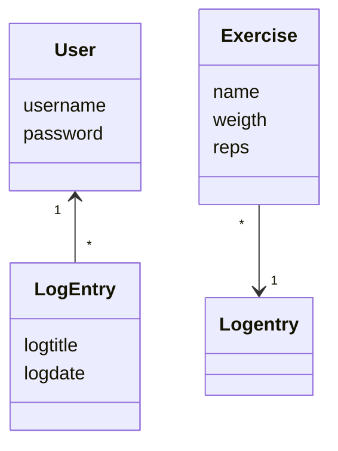

```mermaid
 classDiagram
      User "1" <-- "*" LogEntry
      Exercise "*" --> "1" Logentry
      class User{
          username
          password
      }
      class LogEntry{
          logtitle
          logdate
      }
      class Exercise{
          name
          weigth
          reps
      }
```
