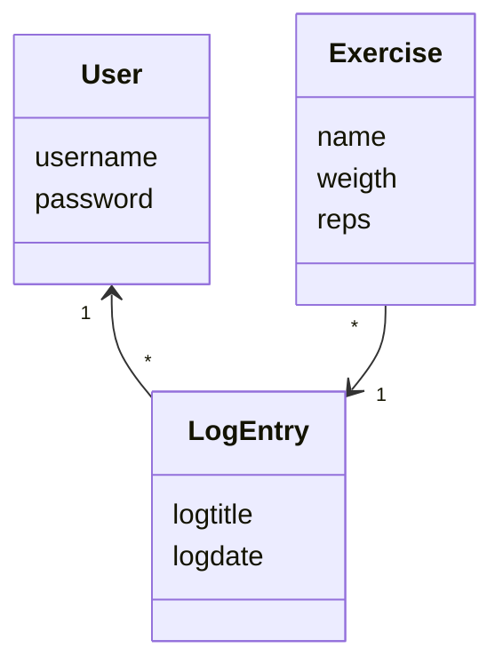
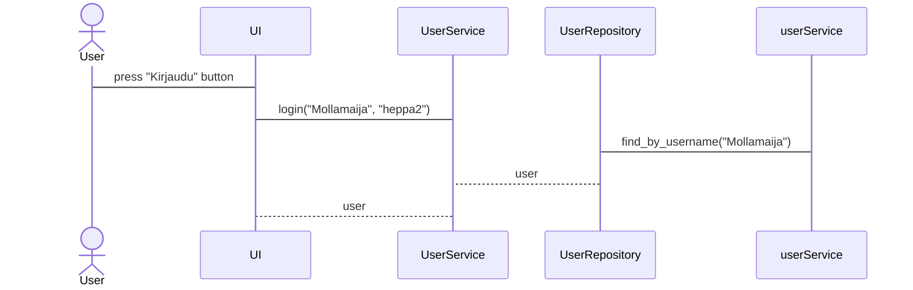

# Sovelluksen logiikka

## Luokkakaavio

```mermaid
 classDiagram
      User "1" <-- "*" LogEntry
      Exercise "*" --> "1" LogEntry
      class User{
          username
          password
      }
      class LogEntry{
          logtitle
          logdate
      }
      class Exercise{
          name
          weigth
          reps
      }
```

## Sekvenssikaavio

# Kirjautuminen

```mermaid
sequenceDiagram
  actor User
  participant UI
  participant UserService
  participant UserRepository
  User->UI: press "Kirjaudu" button
  UI->UserService: login("Mollamaija", "heppa2")
  userService->UserRepository: find_by_username("Mollamaija")
  UserRepository-->UserService: user
  UserService-->UI: user
```
