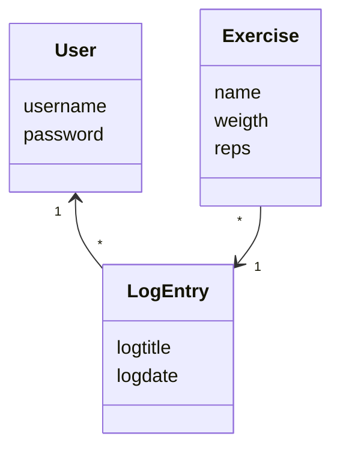
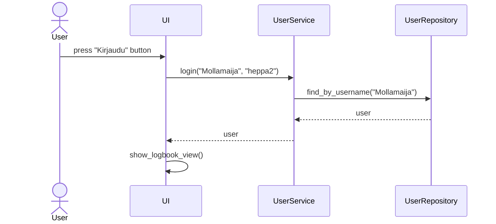

# Sovelluksen logiikka

## Luokkakaavio



## Sekvenssikaaviot

# Kirjautuminen



# Uuden käyttäjän luominen

```mermaid
  actor User
  participant UI
  participant UserService
  participant UserRepository
  User->>UI: press "Luo käyttäjä" button
  UI->>UserService: create_new_user("Mollamaija", "1244")
  UserService->>UserRepository: find_by_username("Mollamaija")
  UserRepository-->>UserService: user
  UserService-->>UI: user
  UI->>UI: show_login_view()
  

