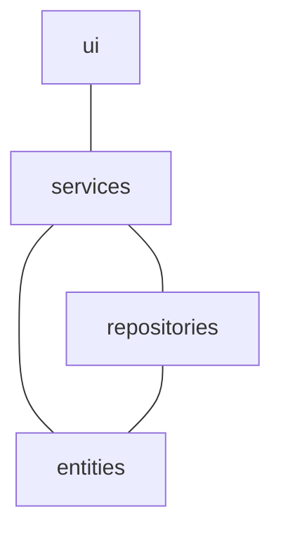
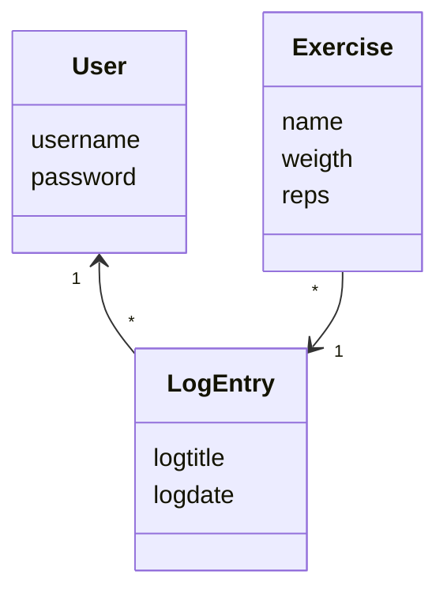
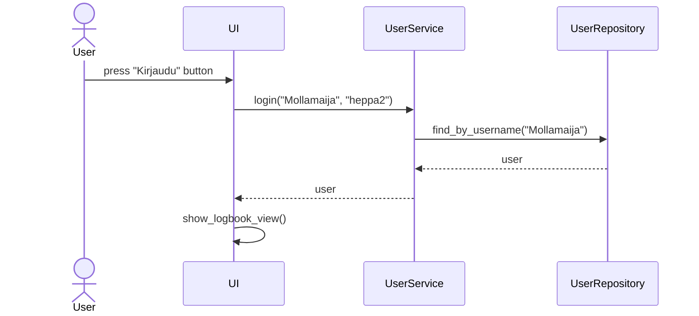

# Sovelluksen logiikka


## Rakenne

Lihasloki-sovelluksen koodin pakkausrakenne on seuraava:


Pakkaus *ui*-vastaa käyttöliittymästä, *services* sovelluslogiikasta ja *repositories* tietojen tallennuksesta tiedostoon ja tietokantaan. *Entities* sisältää sovelluksen logiikan kannalta oleellisia luokkia.

## Käyttöliittymä

Käyttöliittymällä on neljä erilaista näkymää:
- Kirjautuminen
- Uuden käyttäjän luonti
- Yhden käyttäjän näkymä / lista treeneistä
- Treenin kirjaus-näkymä

Kaikki käyttöliittymän näkymät ovat erillisiä luokkia, joita hallitsee UI-luokka. UI-luokka vastaa siitä, mikä näkymä näytetään. Näkymät kutsuvat aina services-luokkia.

## Sovelluslogiikka

Lihasloki-sovelluksen kolme luokkaa ovat User, LogEntry ja Exercise. User-luokka kuvaa yhtä käyttäjää, LogEntry yhtä yhden käyttäjän treenikirjausta ja Exercise yhtä liikettä, joita voi olla yhdessä treenissä useita.



## Toiminnallisuus

### Kirjautuminen


Painamalla kirjaudu-nappulaa tapahtumankäsittelijä kutsuu UserService-luokan metodia. Parametriksi annetaan käyttäjätunnus ja salasana. Tämän jälkeen sovellus tutkii, UserRepositoryn avulla, että käyttäjä on olemassa ja että salasana on oikein. Jos kaikki on ok, kirjautuminen onnistuu ja käyttöliittymä UI-luokka näyttää treeninkirjausnäkymän kirjautuneelle käyttäjälle.

### Uuden käyttäjän luominen

```mermaid
sequenceDiagram
  actor User
  participant UI
  participant UserService
  participant UserRepository
  User->>UI: press "Luo käyttäjä" button
  UI->>UserService: create_new_user("Mollamaija", "1244")
  UserService->>UserRepository: find_by_username("Mollamaija")
  UserRepository-->>UserService: user
  UserService-->>UI: user
  UI->>UI: show_login_view()
 ```
Ennen uuden käyttäjän luomisessa käyttöliittymältä tehdään tarkistus, että käyttäjätunnus on vähintään 5 merkkiä ja salana täsmää salasana uudelleen -kentän kanssa. Tämän jälkeen käyttöliittymältä kutsutaan Luo käyttäjä -painiketta painettaessa UserServiceä, joka etsii, onko käyttäjää jo olemassa. Tämä tehdään UserRepositor-luokan avulla, jolle annetaan käyttäjän käyttöliitymällä kenttiin syöttämät arvot parametreina. Jos samannimistä käyttäjää ei löydy, lisätään käyttäjä sqlite-tietokantaan. Tämän jälkeen käyttöliittymä palaa kirjautumisnäkymään. 

 
 ### Uuden treenin lisääminen

```mermaid
sequenceDiagram
  actor User
  participant UI
  participant LogbookService
  participant LogbookRepository
  User->>UI: press "Lisää uusi treeni" button
  UI->>LogbookService: create_new_entry("Mollamaija", "jalkapäivä", "3.4.2023")
  LogbookService->>LogbookRepository: create_new_entry("entry)
  LogbookRepository-->>LogbookService: entry
  LogbookService-->>UI: entry
  UI->>UI: show_logbook_view()
 ```
 
Uusi treeni luodaan painamalla Luo uusi treeni, jolloin tapahtumankäsittelijä avaa uuden näkymän. Tallenna-nappulasta kutsutaan tapahtumankäsittelijän avulla LogbookService-luokkaa. Luokka luo uuden LogEntry-olion ja kutsuu LogbookRepositorya. LogbookRepository-luokka vie olion csv-tiedostoon. Tämän jälkeen näytetään yhden käyttäjän näkymä, jossa näkyvät kaikki treenikirjaukset.
