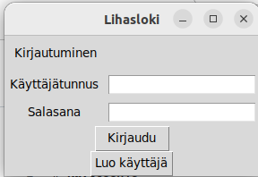
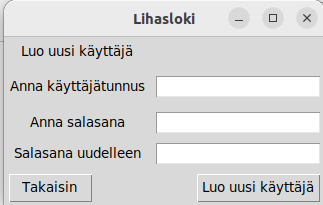
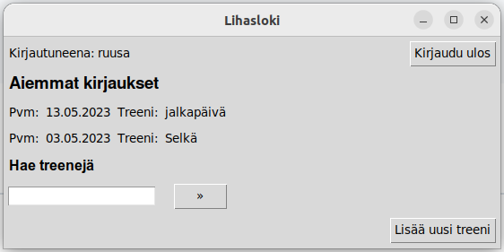

# Käyttöohje

Lataa viimeisimmän [releasen](https://github.com/brotholi/ot-harjoitustyo/releases) lähdekoodi Source code -kohdasta Assets-osion alta

## Ohjelman käynnistäminen

Asenna riippuvuudet ennen ohjelman käynnistystä seuraavalla komennolla:

```bash
poetry install
```

Tämän jälkeen suorita alustustoimenpiteet komennolla:

```bash
poetry run invoke build
```

Lopuksi käynnistä ohjelma komennolla:

```
poetry run invoke start
```

## Kirjautuminen

Sovellus avautuu kirjautumisnäkymään:



Voit kirjautua sisään kirjoittamalla olemassaolevan käyttäjätunnuksen ja salasanan kenttiin. Tämän jälkeen paina *kirjaudu*.

Kirjautumisnäkymästä pääsee luomaan uuden käyttäjän painamalla *Luo uusi käyttäjä*. Tämä avaa uuden näkymän, josta pääsee takaisin painamalla *takaisin*.



Uuden käyttäjän voi luoda syöttämällä tiedot kenttiin. Käyttäjätunnuksen on oltava vähintään 5 merkkiä pitkä.

Kirjautuminen avaa käyttäjälle oman näkymän: 



*Kirjaudu ulos*-nappula kirjaa käyttäjän ulos.

Uuden kirjauksen voi luoda painamalla *Luo uusi treeni*.

Viiden aikaisemman treenikirjauksen päivämäärä ja nimi näytetään *Aikaisemmat treenit*-otsikon alla.

Aikaisempien treenien tarkempia tietoja voi saada kirjoittamalla alhaalla olevaan kenttään treenin nimen. 

Tällöin tuodaan näkyviin lista tällä nimellä olevista treeneistä ja niiden liikkeistä.
