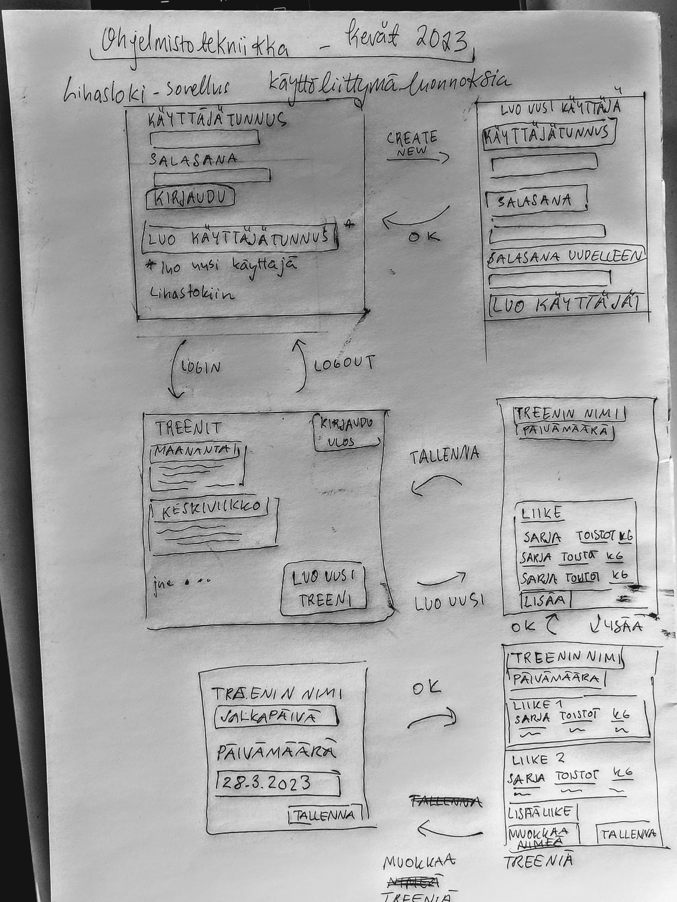

# Vaatimusmäärittely
## Sovelluksen tarkoitus

*Lihasloki*-sovelluksella pidetään kirjaa kuntosalitreeneistä. Sovellukseen kirjataan yksittäisiä tehtyjä treenejä. Sovellusta voivat käyttää useat eri käyttäjät luomalla käyttäjätunnuksen. Jokaiselle käyttäjätunnukselle tallennetaan käyttäjän oma treenihistoria.

## Käyttäjäroolit

Sovelluksessa on tavallisia käyttäjiä ja pääkäyttäjä. Tavallinen käyttäjä voi luoda uuden käyttäjätilin, jolle täytyy lisätä käyttäjätunnus ja salasana. Pääkäyttäjällä on enemmän oikeuksia kuin tavallisella käyttäjällä. Pääkäyttäjä voi muun muassa nähdä, kuinka monta käyttäjää sovelluksella on kokonaisuudessaan.

## Käyttöliittymä
  
 
  
*Käyttöliittymän luonnos*

**Alkunäkymä**
- Kirjautumisvaiheessa käyttäjä syöttää käyttäjätunnuksen ja salasanan
- Kirjautumisnäytöltä pääsee luomaan uuden käyttäjätunnuksen

**Uuden käyttäjätunnuksen luonti**
- Kun käyttäjä luo uuden tunnuksen, syötetään käyttäjätunnus ja salasana 
- Uusi tunnus luodaan painamalla *luo käyttäjä*
- Uuden käyttäjän luonnista pääsee takaisin kirjautumiseen joko luomalla uuden tunnuksen tai painamalla *takaisin*

**Kaikki kirjaukset**
- Kirjausnäkymässä käyttäjä näkee aikaisemmin kirjaamansa treenit
- Kirjausnäkymästä pääsee yksittäisen treenin kirjaamiseen painamalla *uusi treeni*
- Kirjausnäkymästä käyttäjä pääsee kirjautumaan ulos 
- Aikaisempia treenejä voi etsiä syöttämällä treenin nimen alhaalla olevaan kenttään

**Treenin kirjaus**
- Treeninkirjausnäkymässä käyttäjä voi aloittaa uuden treenin kirjauksen
- Kirjaukselle on annettava nimi
- Treeninkirjausnäkymästä käyttäjä pääsee liikkeidenkirjausnäkymään painamalla *tallenna*
- Treenin päivämäärää voi muuttaa, oletusarvoisesti se on kuluva päivä

**Liikkeiden kirjaus**
- Liikkeidenkirjausnäkymässä käyttäjä voi syöttää uusia liikkeitä treeniin
- Liikkeidenkirjausnäkymästä pääsee takaisin kaikkien kirjausten näkymään painamalla *tallenna*

## Toiminnallisuus perusversiossa
- Käyttäjä voi luoda sovellukseen tunnuksen 
  - Käyttäjätunnuksen on oltava vähintään 5 merkkiä pitkä ja uniikki
- Käyttäjä voi kirjautua sovellukseen 
- Käyttäjälle näkyvät vain käyttäjän itse kirjaamat treenit
- Käyttäjä voi kirjata yksittäisen treenin, jolle voi määritellä nimen 
- Yksittäiseen treeniin voi kirjata päivämäärän 
- Jokaiseen treeniin voi kirjata useita liikkeitä
- Käyttäjä voi lisätä jokaiselle treenin liikkeelle nimen ja sarjojen (settien) määrän 
- Jokaiselle setille voi kertoa toistojen määrä ja lisäpainon kilogrammoina 
- Käyttäjä voi kirjautua ulos järjestelmästä 

