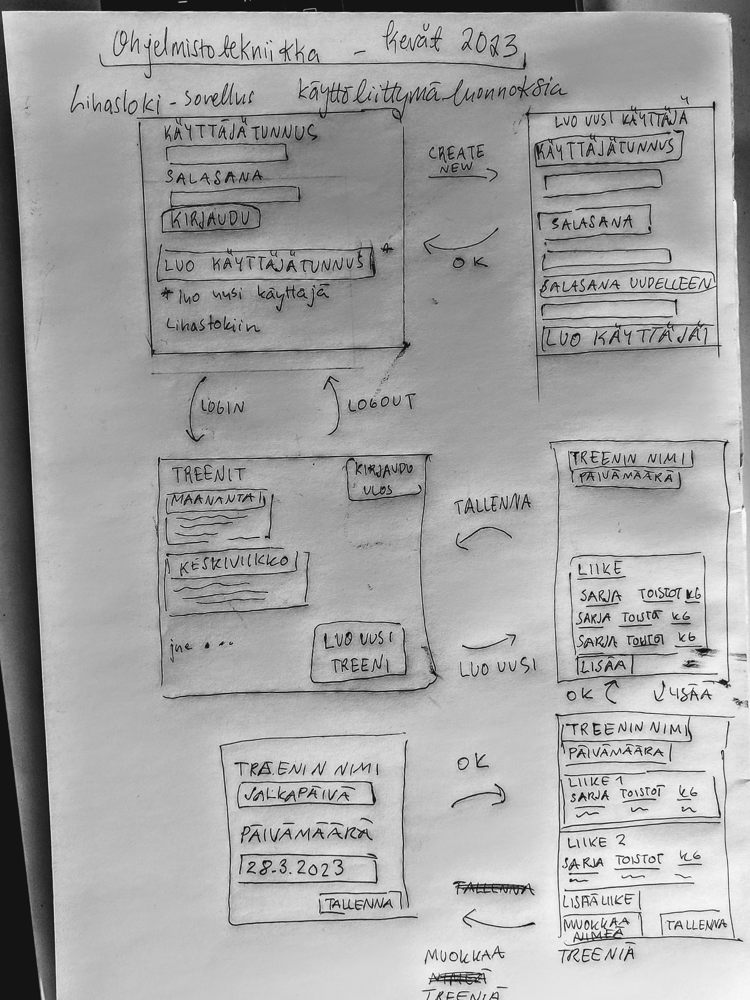

# Vaatimusmäärittely
## Sovelluksen tarkoitus

*Lihasloki*-sovelluksella pidetään kirjaa kuntosalitreeneistä. Sovellukseen kirjataan yksittäisiä tehtyjä treenejä. Sovellusta voivat käyttää useat eri käyttäjät luomalla käyttäjätunnuksen. Jokaiselle käyttäjätunnukselle tallennetaan käyttäjän oma treenihistoria.

## Käyttäjäroolit

Sovelluksessa on tavallisia käyttäjiä ja pääkäyttäjä. Tavallinen käyttäjä voi luoda uuden käyttäjätilin, jolle täytyy lisätä käyttäjätunnus ja salasana. Pääkäyttäjällä on enemmän oikeuksia kuin tavallisella käyttäjällä. Pääkäyttäjä voi muun muassa nähdä, kuinka monta käyttäjää sovelluksessa on.

## Käyttöliittymä
  
  
  
  

**Alkunäkymä**
- Kirjautumisvaiheessa käyttäjä syöttää  käyttäjätunnuksen 
- Kirjautumisnäytöltä pääsee luomaan uuden käyttäjätunnuksen

**Uuden käyttäjätunnuksen luonti**
- Kun käyttäjä luo uuden tunnuksen, syötetään käyttäjätunnus ja salasana 
- Uusi tunnus luodaan painamalla *luo tunnus*

**Kaikki kirjaukset**
- Kirjausnäkymässä käyttäjä näkee aikaisemmin kirjaamansa treenit
- Kirjausnäkymästä pääsee yksittäisen treenin kirjaamiseen painamalla uusi
- Kirjausnäkymästä käyttäjä pääsee kirjautumaan ulos

**Treenin kirjaus**
- Treeninkirjausnäkymässä käyttäjä voi syöttää uusia liikkeitä treeniin
- Treeninkirjausnäkymästä käyttäjä pääsee takaisin yleisnäkymään painamalla lopeta/tallenna
- Treenin nimeä ja päivämäärää voi muuttaa

## Toiminnallisuus perusversiossa
- Käyttäjä voi luoda sovellukseen tunnuksen
  - Käyttäjätunnuksen on oltava vähintään 5 merkkiä pitkä ja uniikki
- Käyttäjä voi kirjautua sovellukseen
- Käyttäjälle näkyvät vain käyttäjän itse kirjaamat treenit
- Käyttäjä voi kirjata yksittäisen treenin, jolle voi määritellä nimen
- Yksittäiseen treeniin voi kirjata päivämäärän
- Jokaiseen treeniin voi kirjata useita liikkeitä
- Käyttäjä voi lisätä jokaiselle treenin liikkeelle nimen ja sarjojen (settien) määrän
- Jokaiselle setille käyttäjä voi kertoa toistojen määrä ja lisäpainon kilogrammoina.
- Käyttäjä voi kirjautua ulos järjestelmästä

## Lisätoiminnallisuus - jatkokehittelyideoita
- Omien ennätysten tarkastelu: Sovellus kertoo käyttäjälle henkilökohtaisen ennätyksen jokaisessa liikkeessä treenihistorian perusteella. Ennätys eli personal best lasketaan sekä kilojen että toistojen avulla. 
- Sovellus ilmoittaa jokaisen kirjatun treenin kohdalla personal best:ien määrän. 
- Sovellukseen voi tallentaa treeniohjelmapohjia, jotka sisältävät käyttäjän valmiiksi määrittelemiä liikkeitä. Treeniohjelmapohjien avulla voi suoraan kirjata tehdyn treenin. 
- Treeniohjelman kirjaamisen voi aloittaa myös ilman pohjaa.
- Käyttäjä voi kirjata myös lämmittelykierrokset erillisinä jokaisen liikeen kohdalle. 
- Sovellus kertoo, kuinka monta treeniä käyttäjä on kirjannut viikossa.

**Omien käyttäjätietojen muutokset:**

- Käyttäjä voi asettaa tavoitteeksi tietyn määrän treenejä viikossa ja sovellus ilmoittaa aina, milloin tavoitteeseen on päästy. Ilmoittaminen tapahtuu treenin kirjaamisen päättyessä. Samassa kohtaa ilmoitetaan henkilökohtaisista ennätyksistä.
- Treenien poistaminen historiasta
- Käyttäjätunnuksen poistaminen
