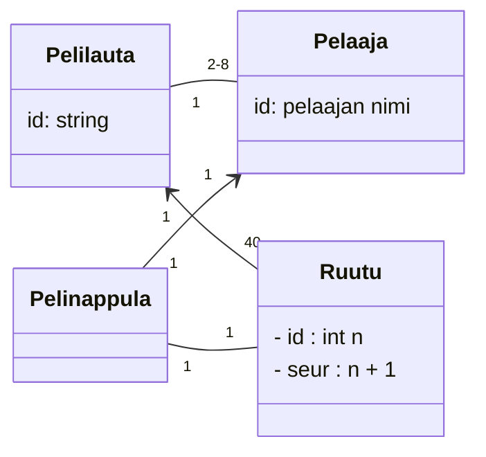

```mermaid
 classDiagram
    direction LR
    
    
    class Pelaaja {
        id: pelaajan nimi
    }

    class Pelilauta {
     id: string   
    }
    
    
    class Ruutu {
    - id : int n
    - seur : n + 1
    }
    
    class Pelinappula {
    }
    

    Pelilauta "1" -- "2-8" Pelaaja
    Pelilauta "1" <-- "40" Ruutu
    Pelinappula "1" --> "1" Pelaaja
    Pelinappula "1" -- "1" Ruutu
    
    


    
```
