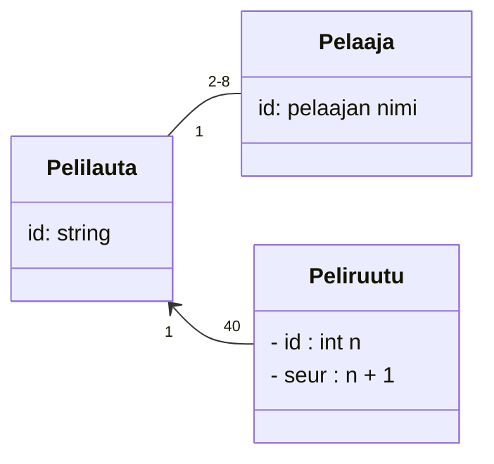

```mermaid
 classDiagram
    direction LR
    
    
    class Pelaaja {
        id: pelaajan nimi
    }

    class Pelilauta {
     id: string   
    }
    
    
    class Peliruutu {
    - id : int n
    - seur : n + 1
    }

    Pelilauta "1" -- "2-8" Pelaaja
    Pelilauta "1" <-- "40" Peliruutu
    

```
