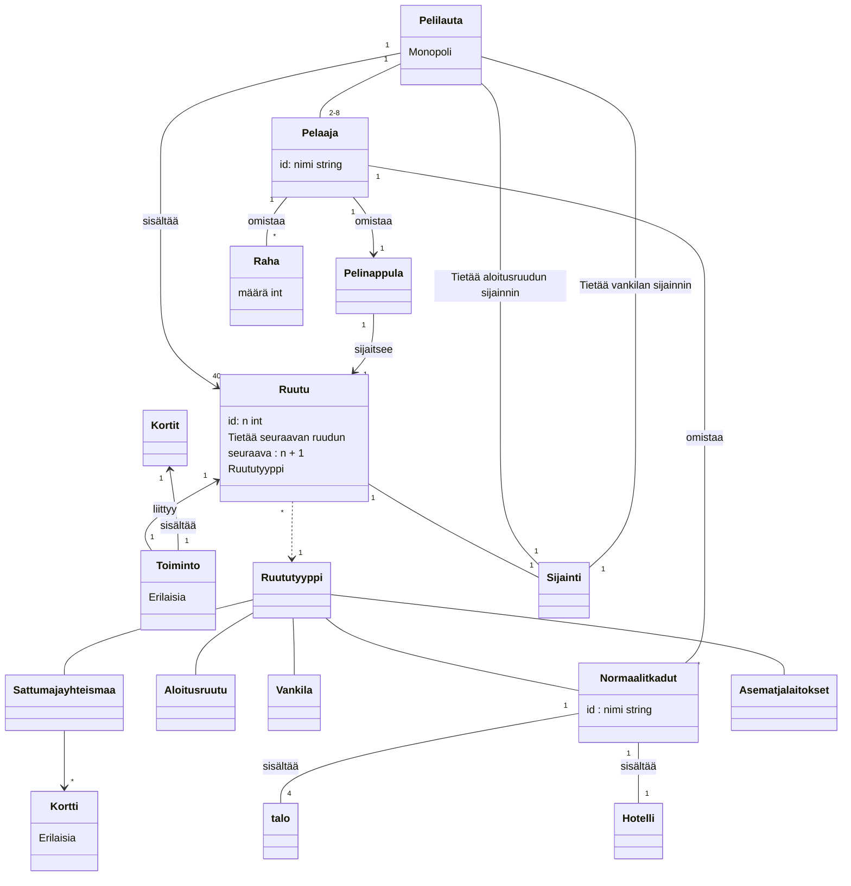

```mermaid
 classDiagram
    
    
    class Pelaaja {
       id: nimi string
    }

    class Pelilauta {
     Monopoli 
    }
    
    
    class Ruutu {
     id: n int
     Tietää seuraavan ruudun
     seuraava : n + 1
     Ruututyyppi 
    
    }
    
    

    class Normaalit kadut {
     id : nimi string
    }
         
    class Pelinappula {
    }
    
    class Toiminto {
     Erilaisia
    }
    
    class Kortti {
     Erilaisia
    
    }
    
    class Raha {
    määrä int
    }
    

    Pelilauta "1" -- "2-8" Pelaaja

    Pelaaja "1" --> "1" Pelinappula : omistaa
    Pelilauta "1" --> "40" Ruutu : sisältää
    Pelinappula "1" --> "1" Ruutu : sijaitsee

    Ruutu "*" ..> "1" Ruututyyppi 
    
    Ruututyyppi -- Aloitusruutu
    Ruututyyppi -- Vankila
    Ruututyyppi -- Sattuma ja yhteismaa
    Ruututyyppi -- Asemat ja laitokset
    Ruututyyppi -- Normaalit kadut


    Sattuma ja yhteismaa --> "*" Kortti
    
    Ruutu "1" -- "1" Sijainti
    
    Pelilauta -- "1" Sijainti : Tietää aloitusruudun sijainnin
    Pelilauta -- "1" Sijainti : Tietää vankilan sijainnin
    
    Ruutu "1" <-- "1" Toiminto : liittyy
    
    Kortit "1" <-- "1" Toiminto : sisältää
    
    Normaalit kadut "1" -- "4" talo : sisältää
    Normaalit kadut "1" -- "1" Hotelli : sisältää
    
    Pelaaja "1" -- "*" Normaalit kadut : omistaa
    
    Pelaaja "1" -- "*" Raha : omistaa
    
    


    
```
