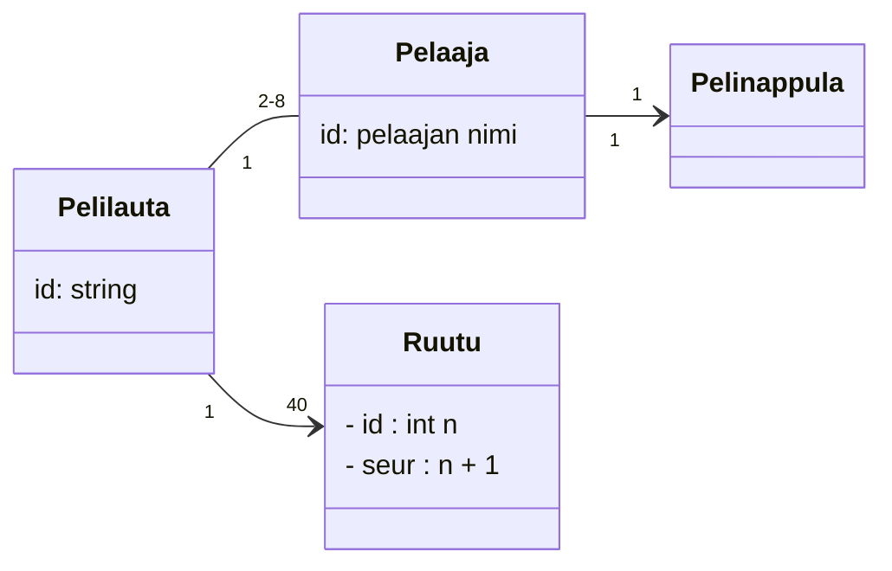

```mermaid
 classDiagram
    
    
    class Pelaaja {
        id: pelaajan nimi
    }

    class Pelilauta {
     id: string   
    }
    
    
    class Ruutu {
    - id : int n
    - seur : n + 1
    }
    
    class Pelinappula {
    }
    
    direction LR
    Pelilauta "1" -- "2-8" Pelaaja
    direction TD
    Pelaaja "1" --> "1" Pelinappula
    Pelilauta "1" --> "40" Ruutu
    
    
    


    
```
