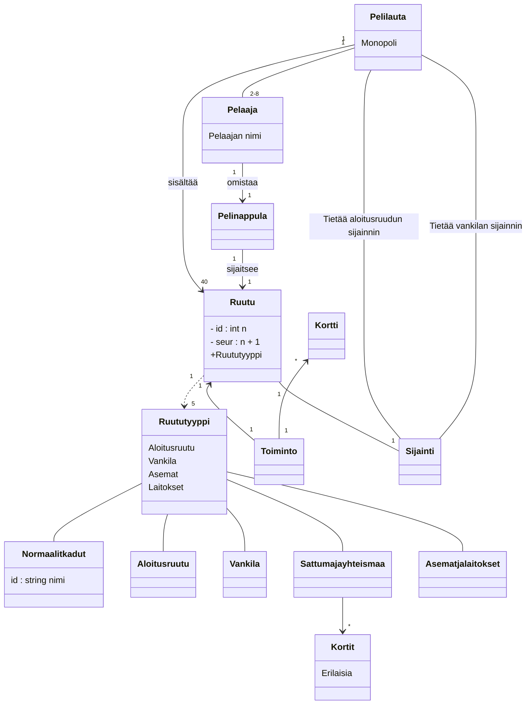

```mermaid
 classDiagram
    
    
    class Pelaaja {
        Pelaajan nimi
    }

    class Pelilauta {
     Monopoli 
    }
    
    
    class Ruutu {
    - id : int n
    - seur : n + 1
     +Ruututyyppi 
    
    }
    
    class Ruututyyppi {
     Aloitusruutu
     Vankila
     Asemat
     Laitokset
   
    }
    
    

    class Normaalit kadut {
    id : string nimi
    }
         
    class Pelinappula {
    }
    
    class Toiminto {
    
    }
    
    class Kortit {
    Erilaisia
    
    }
    

    Pelilauta "1" -- "2-8" Pelaaja

    Pelaaja "1" --> "1" Pelinappula : omistaa
    Pelilauta "1" --> "40" Ruutu : sisältää
    Pelinappula "1" --> "1" Ruutu : sijaitsee

    Ruutu "1" ..> "5" Ruututyyppi 
    
    Ruututyyppi -- Aloitusruutu
    Ruututyyppi -- Vankila
    Ruututyyppi -- Sattuma ja yhteismaa
    Ruututyyppi -- Asemat ja laitokset
    Ruututyyppi -- Normaalit kadut


    Sattuma ja yhteismaa --> "*" Kortit
    
    Ruutu "1" -- "1" Sijainti
    
    Pelilauta -- Sijainti : Tietää aloitusruudun sijainnin
    Pelilauta -- Sijainti : Tietää vankilan sijainnin
    
    Ruutu "1" <-- "1" Toiminto
    
    Kortti "*" <-- "1" Toiminto
    
    


    
```
