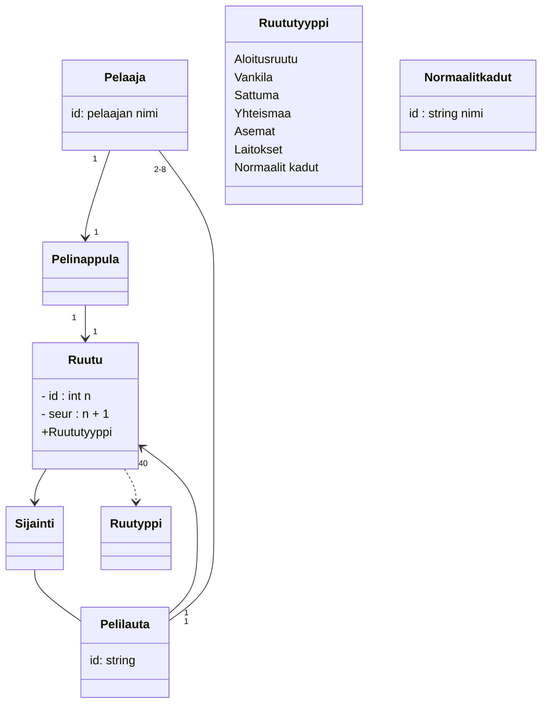

```mermaid
 classDiagram
    
    
    class Pelaaja {
        id: pelaajan nimi
    }

    class Pelilauta {
     id: string   
    }
    
    
    class Ruutu {
    - id : int n
    - seur : n + 1
     +Ruututyyppi 
    
    }
    
    class Ruututyyppi {
     Aloitusruutu
     Vankila
     Sattuma
     Yhteismaa
     Asemat
     Laitokset
     Normaalit kadut
   
    }
    
    

    class Normaalit kadut {
    id : string nimi
    }
         
    class Pelinappula {
    }
    

    Pelilauta "1" -- "2-8" Pelaaja

    Pelaaja "1" --> "1" Pelinappula
    Pelilauta "1" --> "40" Ruutu
    Pelinappula "1" --> "1" Ruutu

    
    Sijainti -- Pelilauta
    
    Ruutu --> Sijainti
    Ruutu ..> Ruutyppi 
    


    
```
