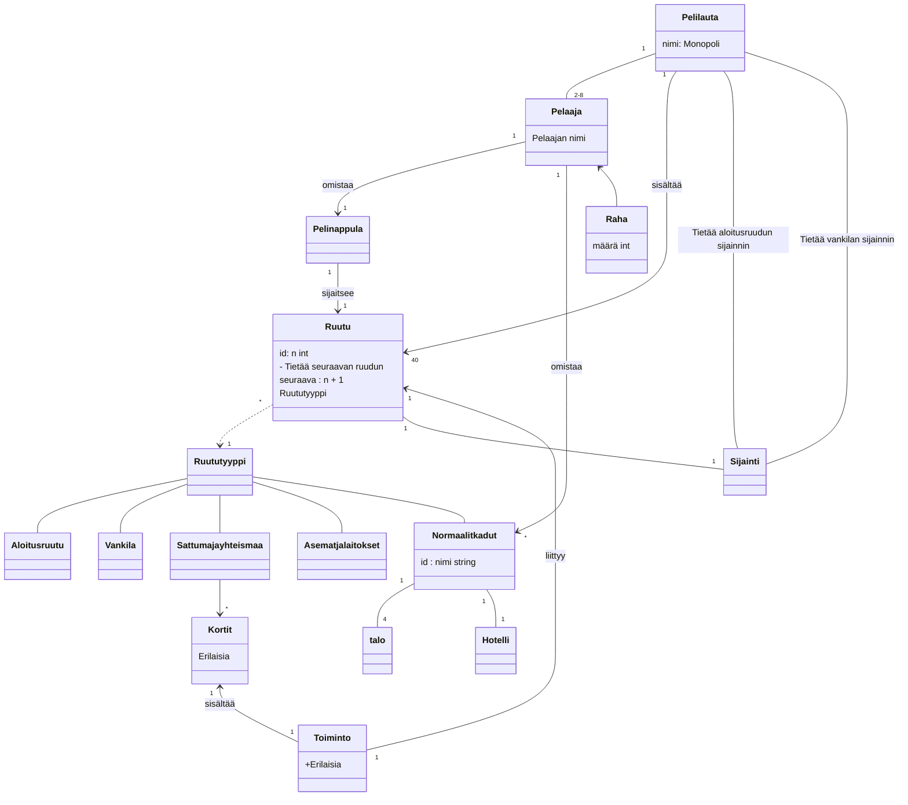

```mermaid
 classDiagram
    
    
    class Pelaaja {
        Pelaajan nimi
    }

    class Pelilauta {
     nimi: Monopoli 
    }
    
    
    class Ruutu {
    id: n int
    - Tietää seuraavan ruudun
    seuraava : n + 1
    Ruututyyppi 
    
    }
    
    

    class Normaalit kadut {
    id : nimi string
    }
         
    class Pelinappula {
    }
    
    class Toiminto {
    +Erilaisia
    }
    
    class Kortit {
    Erilaisia
    
    }
    
    class Raha {
    määrä int
    }
    

    Pelilauta "1" -- "2-8" Pelaaja

    Pelaaja "1" --> "1" Pelinappula : omistaa
    Pelilauta "1" --> "40" Ruutu : sisältää
    Pelinappula "1" --> "1" Ruutu : sijaitsee

    Ruutu "*" ..> "1" Ruututyyppi 
    
    Ruututyyppi -- Aloitusruutu
    Ruututyyppi -- Vankila
    Ruututyyppi -- Sattuma ja yhteismaa
    Ruututyyppi -- Asemat ja laitokset
    Ruututyyppi -- Normaalit kadut


    Sattuma ja yhteismaa --> "*" Kortit
    
    Ruutu "1" -- "1" Sijainti
    
    Pelilauta -- Sijainti : Tietää aloitusruudun sijainnin
    Pelilauta -- Sijainti : Tietää vankilan sijainnin
    
    Ruutu "1" <-- "1" Toiminto : liittyy
    
    Kortit "1" <-- "1" Toiminto : sisältää
    
    Normaalit kadut "1" -- "4" talo
    Normaalit kadut "1" -- "1" Hotelli
    
    Pelaaja "1" --> "*" Normaalit kadut : omistaa
    
    Pelaaja <-- Raha
    
    


    
```
