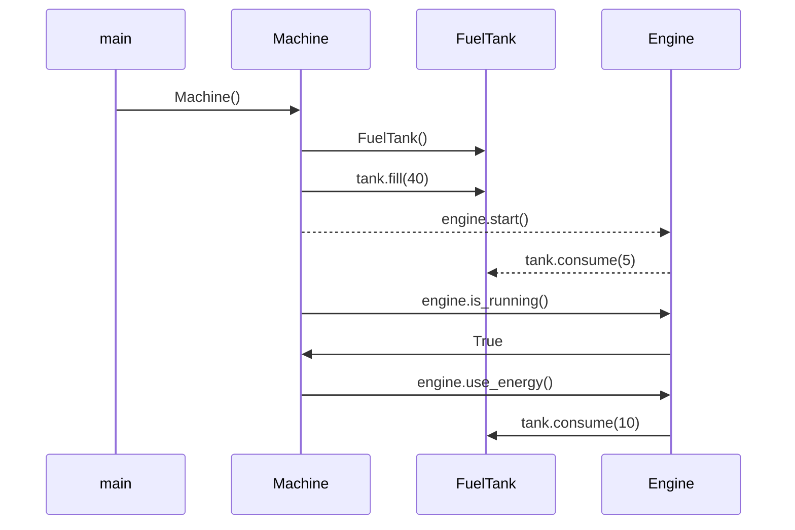

Tehtävä 3: Sekvenssikaavio

```mermaid
sequenceDiagram
  participant main
  participant Machine
  participant FuelTank
  participant Engine
  main->>Machine: Machine() 
  Machine->>FuelTank: FuelTank()
  Machine->>FuelTank: tank.fill(40)
  Machine-->>Engine: engine.start()
  Engine-->>FuelTank: tank.consume(5)
  Machine->>Engine: engine.is_running()
  Engine->>Machine: True
  Machine->>Engine: engine.use_energy()
  Engine->>FuelTank: tank.consume(10)
  
  
  
  
```
