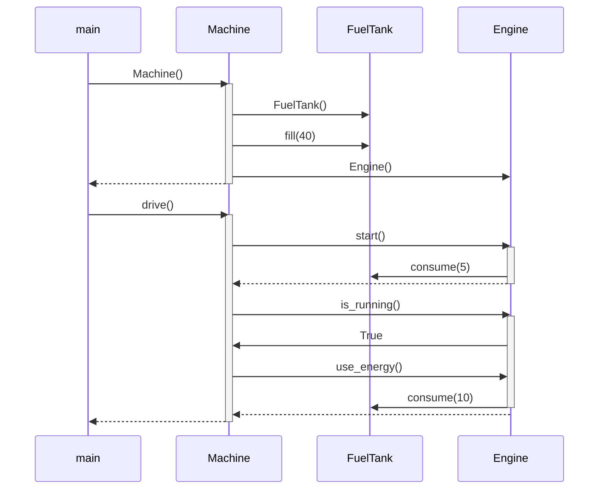

Tehtävä 3: Sekvenssikaavio

```mermaid
sequenceDiagram
  participant main
  participant Machine
  participant FuelTank
  participant Engine
  
  main->>Machine: Machine() 
  activate Machine
  Machine->>FuelTank: FuelTank()
  Machine->>FuelTank: fill(40)
  Machine->>Engine: Engine()
  Machine-->>main:   
  deactivate Machine
  
  main->>Machine: drive()
  activate Machine
  Machine->>Engine: start()
  activate Engine
  Engine->>FuelTank: consume(5)
  Engine-->>Machine:    
  deactivate Engine
  Machine->>Engine: is_running()
  activate Engine
  Engine->>Machine: True
  Machine->>Engine: use_energy()
 
  Engine->>FuelTank: consume(10)
 
  deactivate Engine
  Engine-->>Machine:      
  Machine-->>main:   
  deactivate Machine

  
  
  
```
